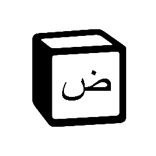
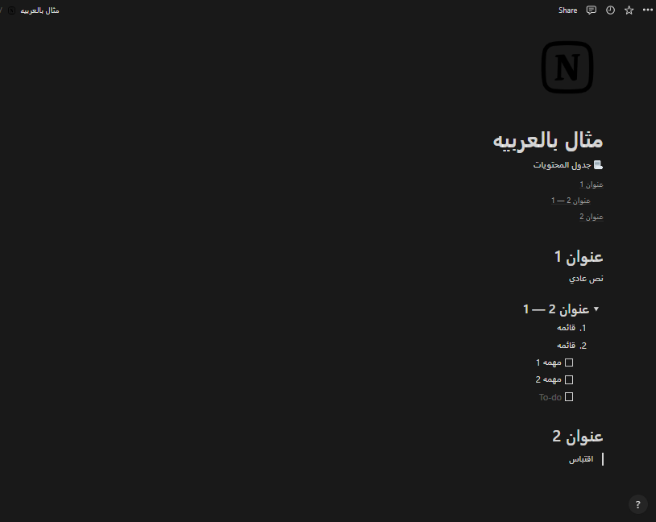

### Notion ar

[Report Bug](https://github.com/molo-7/notion-ar/issues) · [Request Feature](https://github.com/molo-7/notion-ar/issues)

Arabic and rtl support for [notion](https://www.notion.so/)

This extension injects a javascript and css file to the notion website, and enables using arabic in notion in the most used components, auto rtl alignment for detected lists/text blocks and more.

# Downloads

1. Download [Latest Release](https://github.com/molo-7/notion-ar/releases/latest) `extension.zip`.
2. Extract file
3. Visit `chrome://extensions` (or menu -> Tools -> Extensions).
4. Enable Developer mode by ticking the checkbox in the upper-right corner.
5. Click on the "Load unpacked extension..." button.
6. Select the directory containing your unpacked extension.

# Screen Shot

# Contributing

If you have a suggestion that would make this better, please fork the repo and create a pull request. You can also simply open an issue. Don't forget to give the project a star! Thanks again!

1. Fork the Project
1. Create your Feature Branch (git checkout -b feature/AmazingFeature)
1. Commit your Changes (git commit -m 'Add some AmazingFeature')
1. Push to the Branch (git push origin feature/AmazingFeature)
1. Open a Pull Request

[Back To Top](#top)
